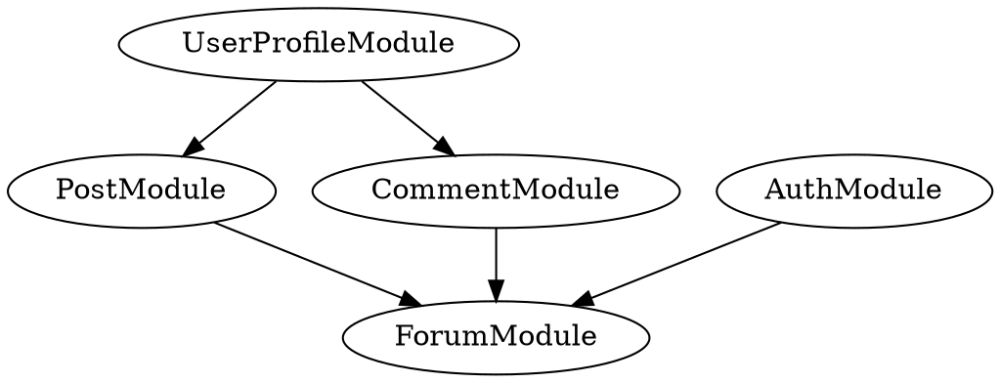
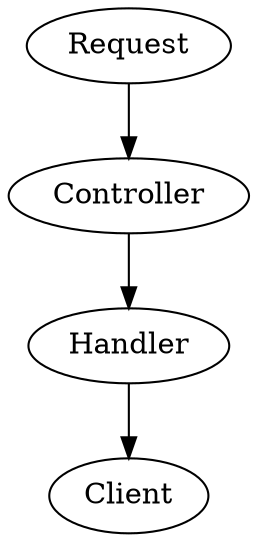
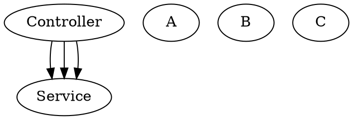

# NestJS

Built with full support of TS.

It provides an out-of-the-box and ready to use architecture.

## CLI commands

`nest new <app-name>`

## Modules

Each application has at least one module, the root module. This is the starting point
of the application.

Modules are an effective way to organize components by a closely related set of capabilities.

It's a good practice to have a folder per module.
Also, because modules are singletons, they can be imported by other modules.

A module is defined by annotating a class with the `@Module` decorator.

### Properties

- **providers:** array of providers to be available within the module via dependency injection.
- **controllers:** array of controllers to be instantiated within the module.
- **exports:** array of providers to export to other modules.
- **imports:** list of modules required by this module. Any exported provider by these modules will be available in our module.

#### Example


```TYPESCRIPT
@Module({
    providers: [ForumService],
    controllers: [ForumController],
    imports: [
        PostModule,
        CommentModule,
        AuthModule
    ],
    exports: [
        ForumService
    ]
})
export class ForumModule {}
```

**Command:** `nest g module <module-name>`

## Controllers

Handle incoming requests and return responses to the client.

They are bound to a specific path, a specific resource.

Controllers contain handlers, which handle endpoints and request methods (POST, GET, DELETE, PATCH, PUT).

A controller is defined by annotating a class with the `@Controller` decorator.
It accepts a string, which is the path to be handled by the controller.


### Example

```TYPESCRIPT
@Controller('/tasks')
export class TasksController { }
```

### Handlers

Handlers are simply methods within the controller class, decorated with `@Get`, `@Post`, `@Delete` etc.

```TYPESCRIPT
@Controller('/tasks')
export class TasksController { 
	@Get()
	getAllTasks() {
		// code
		return ...;
	}	
	
	@Post()
        createTask() {
		// code
                return ...;
        }   
}
```

### Diagram



**Command:** `nest g controller <name-or-modulename>`

*Note:* If you specify the name of a module, it will create the controller in the module folder
and update the module file.

## Providers

Providers can be injected into constructors if decorated as `@Injectable`, via dependency injection.
It can be a plain value, class, sync/async func & more.
They must be provided to a module for them to be usable.
They also can be exported from a module, which will make them available for other modules.

### Services

Services are providers. But a provider isn't necessarily a service.

When wrapped with `@Injectable()` and provided to a module, the same instance will be shared across
the application, acting as a single source of truth (state).

A service must be written as the main source of business logic, and will be called by a controller/handler
to validate data, create an item in the db, etc.


### Example

**Within a module: **



```TYPESCRIPT
@Module({
	controllers: [
		TasksController
	],
	providers: [
		TasksService,
		LoggerService
	]
})
export class TasksModule { }
```
**Command:** `nest g service <name-or-moduleName>`
*Note:* If you specify the name of a module, it will create the service in the module folder
and update the module file.

## Dependency Injection (in NestJS)


Any component can inject a provider which is decorated with a `@Injectable`.
Once defined in the constructor, the component will be available as a class property.


```TYPESCRIPT
@Controller('/tasks')
export class TasksController { 
	constructor(private tasksService: TasksService) {}
	
        @Get()
        getAllTasks() {
                return await this.tasksService.getAllTasks();
        }       
}
```
## Data Transfer Objects (DTOs)

A DTO is an object that is used to encapsulate data, and send it from one subsystem of an application to
another. It's not specific to NestJS.

It results in a bulletproof code, as it can be used as a TS type, and which don't have any behavior except
for storage, retrieval, serialization and deserialization of its own data.

It can be useful for data validation, but is not a model definition. It defines the shape of data for a
specific case, for example: creating a task. It can be used using a class or an interface.

The recommended approach is to use classes. The reason is that interfaces are a part of TS and therefore
are not preserved post-compilation. Classes are preserved after compilation.

## Pipes

Pipes operates on the arguments to be processed by the route handler,
just before the handler is called.

They can perform data transformation or data validation. They also can throw
exceptions which will be parsed to return an error.

### ValidationPipe

Validates the compatibility of an entire object against a class 
(type, attributes, etc). If anything goes wrong, an exception will be thrown.

### ParseIntPipe

Validates that an argument is a number. If so, it will be automatically parsed
and used as a type Number.

### Custom Pipes

Pipes are classes annoted with `@Injectable()`.
They must implement the PipeTransform generic interface, which provides a
`transform()` method. This method is called by NestJS to process the arguments.

The `transform()` method accepts two parameters: 
- `value` of the processed argument.
- `metadata` *(optional)* object about the argument.

Whatever is returned from this method will be returned to the route handler.
Exceptions will be sent back to the client.

### Use them

#### Handler-level pipes: 

```TYPESCRIPT
@Post()
@UsePipes(myPipe)
createTask(@Body('description') description: string) {
	// code
	}
```

#### Parameters-level pipes:

```TYPESCRIPT
@Post()
createTask(@Body('description', myPipe) description: string) {
        // code
        }
```

#### Global pipes:

*in main.ts*

```TYPESCRIPT
async function bootstrap() {
  const app = await NestFactory.create(AppModule);
  app.useGlobalPipes(myPipe);
  await app.listen(3000);
}
bootstrap();
```
**You can also bind pipes with class validator/transformer !**
[Doc here](https://github.com/typestack/class-validator#validation-decorators)
`yarn add class-validator class-transformer`

